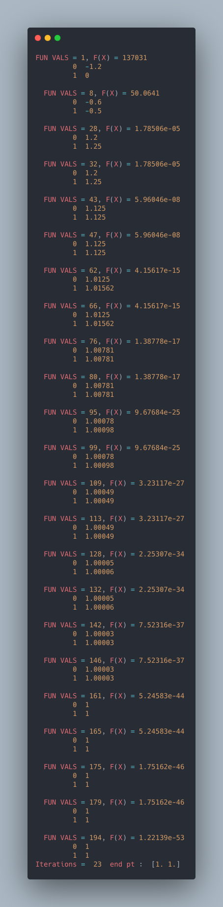
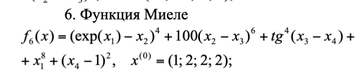
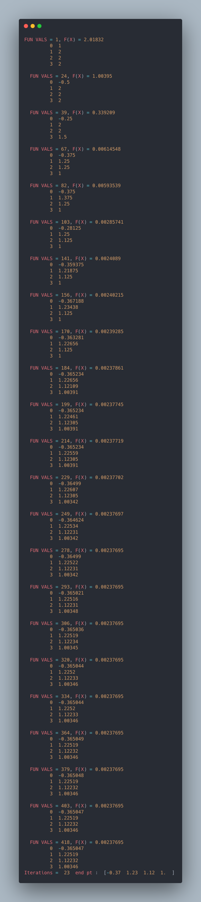

# HookeJeeves

HookeJeeves implementation in Python

_NOTE_: Please, install all dependecies such a `numpy`.

## Quick start

```sh
$ python test.py
```

## Results

Function #2:


Output:



Function #6:



Output:



