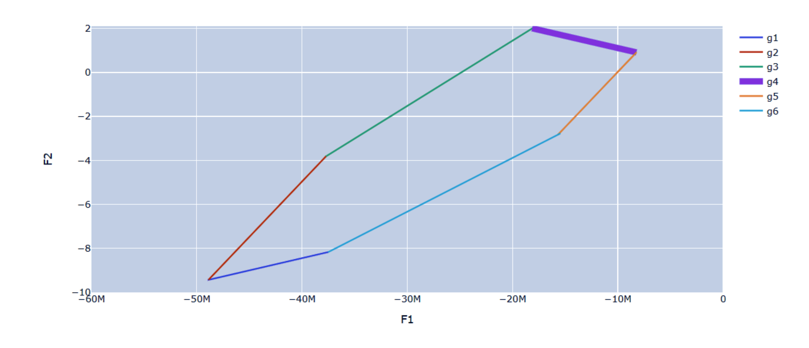
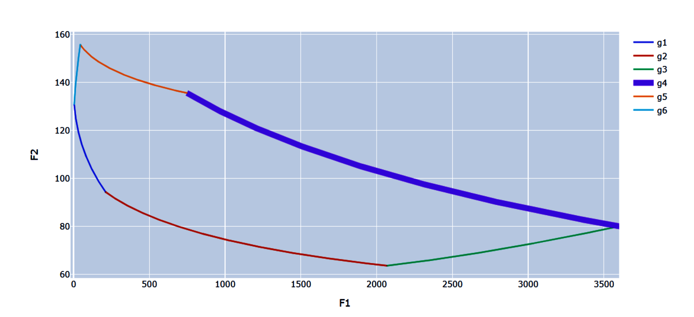

# Многокритериальные задачи линейного и нелинейного программирования

## Цель работы
Исследование многокритериальных задач линейного и нелинейного программирования при различных компромиссных критериях.

## Порядок выполнения работы
1. Определить тип компромиссного критерия (7) или (8), который необходимо использовать для решения варианта задания.
2. Используя программное обеспечение решения задач линейного и нелинейного программирования, исследовать влияние весовых коэффициентов wi на оптимальное компромиссное решение.
3. Изобразить множество допустимых значений критериев в координатах Fi , Fj в соответствие с вариантом задания. Найти Парето-оптимальное
множество решений.

## Результаты работы(графики)

### Множество Парето №1

### Множество Парето №12
