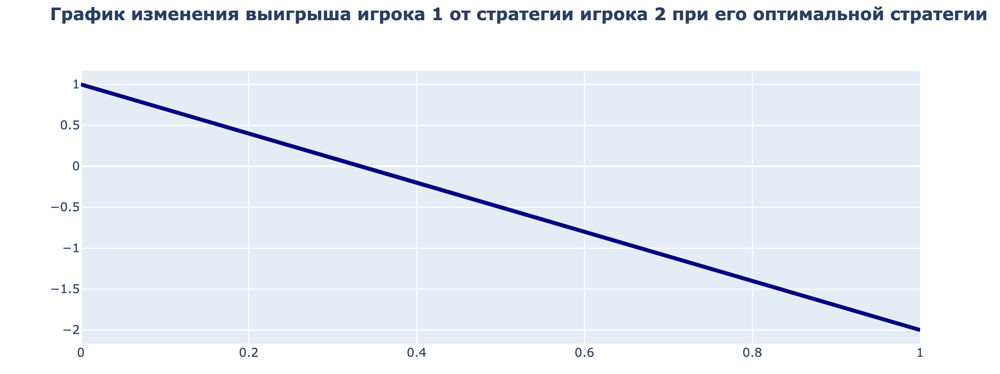
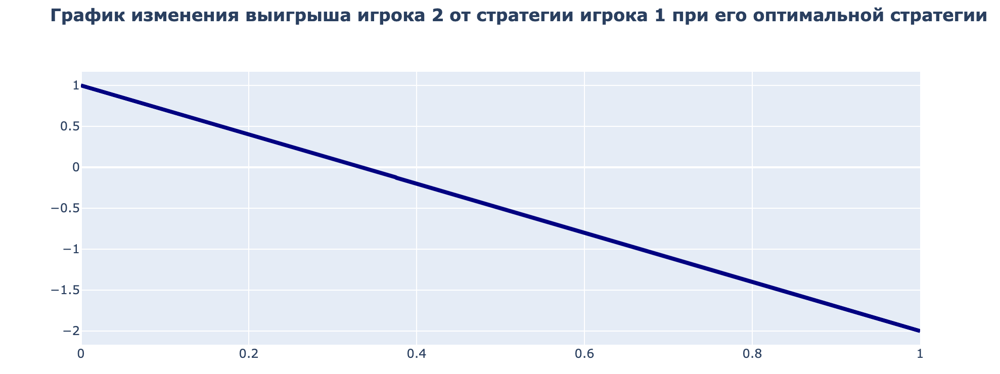

# Теория игр

## 1.1
Матричная игра:

```python
X = [[2, 4, 4, 2],
    [1, 2, 3, 10],
    [5, 5, 4, 7],
    [3, 8, 7, 6]]
```

### Условия игроков:

1. Игрок #1
```
2 * X1 + 1 * X2 + 5 * X3 + 3 * X4 >= 1
4 * X1 + 2 * X2 + 5 * X3 + 8 * X4 >= 1
4 * X1 + 3 * X2 + 4 * X3 + 7 * X4 >= 1
2 * X1 + 10 * X2 + 7 * X3 + 6 * X4 >= 1
```

2. Игрок #2
```
2 * X1 +4 * X2 + 4 * X3 + 2 * X4 <= 1
1 * X1 +2 * X2 + 3 * X3 + 10 * X4 <= 1
5 * X1 +5 * X2 + 4 * X3 + 7 * X4 <= 1
3 * X1 +8 * X2 + 7 * X3 + 6 * X4 <= 1
```

Цена игры = 4.6

Стратегия для игрока #1:
```
  p1 = 0.0
  p2 = 0.0
  p3 = 0.8
  p4 = 0.2
```

Стратегия для игрока #2:
```
  q1 = 0.6
  q2 = 0.0
  q3 = 0.4
  q4 = 0.0
```

## 1.2

Функция полезности:

```python
2 * x1 * x2 + (1 - 2 * x1) * (1 - 3 * x2)
```

Аккуратные стратегии:

1. Игрок #1 = 0.0
2. Игрок #2 = 0.0



