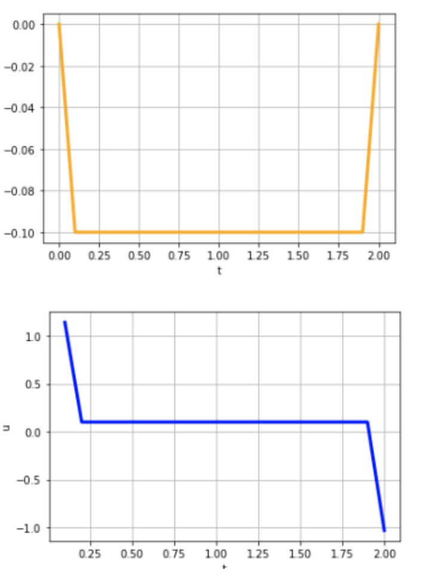

# Задача оптимального управления

Решение по схеме Моисеева.

Делим время на `20` промежутков, строим сетку по `x`, каждая шкала(кроме крйних) распределена от `-3` до `3`.

_Ограничение по модулю = 3_

## Результат

Оптимальное значение(`Jopt`) ≈ 0.5921

Оптимальные траектории:

